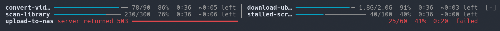

# Simple Progress Bars

Progress bars with time estimates for the long scripts that Claude Code runs. A script reports its progress with one command, for example `claude-progress -n convert 17/240`, and a bar with the count, the percent, the elapsed time, and a time estimate shows in the band above the prompt of Claude Code. Each update costs zero tokens.

The plugin adds the `claude-progress` command to the `PATH` of Claude's Bash tool, and adds a short section to Claude's system prompt about when and how to use it. Run `claude-progress --help` for the full reference.

The command is a bash script. It writes only in `$CLAUDE_CONFIG_DIR/progress`, or `~/.claude/progress`. The plugin only reads that directory, and runs no processes. Neither part uses the network.

Requirements: Claude Code with function hooks (early access), on Linux, macOS, or Windows with Git Bash.

## What the plugin changes in Claude Code

| Hook | Change |
| --- | --- |
| `prompt.compose` | Adds one section, `simple-progress-bars:usage`, at the end of Claude's system prompt. It tells Claude when and how to call `claude-progress`. No other part of the prompt changes. |
| `tool.call` (Bash) | Notes when each foreground Bash call starts and ends. The command, its input, and its result do not change. |
| `ui.render` (`AbovePrompt`) | Draws the bars in the band above the prompt. The transcript and the status line stay as Claude Code draws them. |
| `session.start` | Reads `CLAUDE_CONFIG_DIR`, `HOME`, and `USERPROFILE` only to find the progress directory, and reads the plugin's own `shim.sh`. No value leaves the machine. |

See the [project README](https://github.com/mhgar/claude-simple-progress-bars#readme) for the API, how a bar ends, settings, and development notes.

License: MIT.
